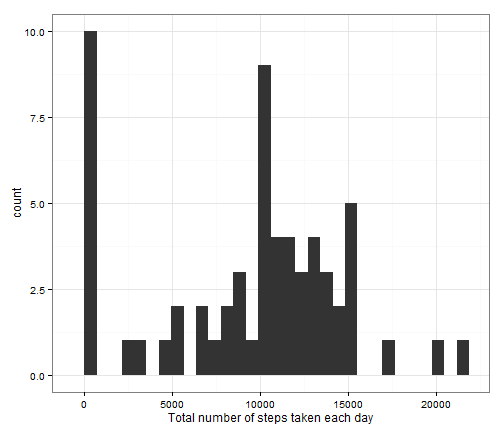
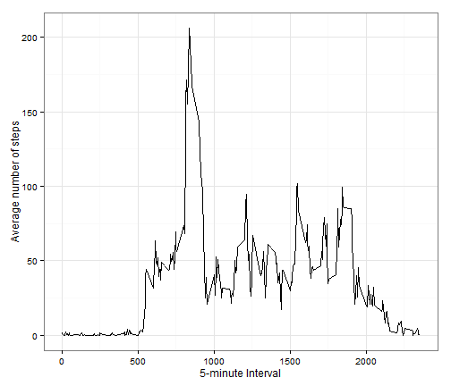
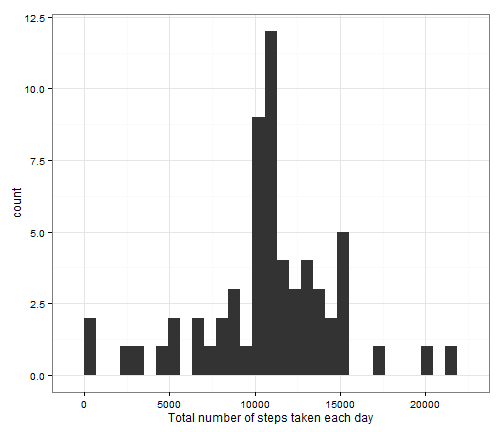
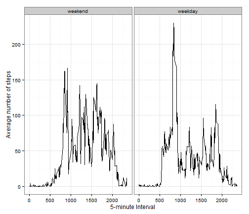

Reproducible Research Project 1
===============================

# Introduction

This assignment makes use of data from a personal activity monitoring device. 
This device collects data at 5 minute intervals through out the day. 
The data consists of two months of data from an anonymous individual collected
during the months of October and November, 2012 and include the number of 
steps taken in 5 minute intervals each day.

# Data

The variables included in this dataset are:
* steps: Number of steps taking in a 5-minute interval (missing values are coded as NA)
* date: The date on which the measurement was taken in YYYY-MM-DD format
* interval: Identifier for the 5-minute interval in which measurement was taken

The dataset is stored in a comma-separated-value (CSV) file and there are a total of 17,568 observations in this dataset.


Load the dataset (csv) into R.

```r
mydata <- read.csv("activity.csv", h=TRUE)
```

## What is mean total number of steps taken per day?

Calculate the total number of steps taken per day.


```r
library(xtable)
total_per_day <- aggregate(mydata$steps,by=list(mydata$date), sum, na.rm=TRUE)
colnames(total_per_day) <- c("Date", "Total Steps")
tpd.table <- xtable(total_per_day[,1:2])
print(tpd.table, type="html")
```

<!-- html table generated in R 3.2.0 by xtable 1.7-4 package -->
<!-- Tue Jun 02 16:00:47 2015 -->
<table border=1>
<tr> <th>  </th> <th> Date </th> <th> Total Steps </th>  </tr>
  <tr> <td align="right"> 1 </td> <td> 2012-10-01 </td> <td align="right">   0 </td> </tr>
  <tr> <td align="right"> 2 </td> <td> 2012-10-02 </td> <td align="right"> 126 </td> </tr>
  <tr> <td align="right"> 3 </td> <td> 2012-10-03 </td> <td align="right"> 11352 </td> </tr>
  <tr> <td align="right"> 4 </td> <td> 2012-10-04 </td> <td align="right"> 12116 </td> </tr>
  <tr> <td align="right"> 5 </td> <td> 2012-10-05 </td> <td align="right"> 13294 </td> </tr>
  <tr> <td align="right"> 6 </td> <td> 2012-10-06 </td> <td align="right"> 15420 </td> </tr>
  <tr> <td align="right"> 7 </td> <td> 2012-10-07 </td> <td align="right"> 11015 </td> </tr>
  <tr> <td align="right"> 8 </td> <td> 2012-10-08 </td> <td align="right">   0 </td> </tr>
  <tr> <td align="right"> 9 </td> <td> 2012-10-09 </td> <td align="right"> 12811 </td> </tr>
  <tr> <td align="right"> 10 </td> <td> 2012-10-10 </td> <td align="right"> 9900 </td> </tr>
  <tr> <td align="right"> 11 </td> <td> 2012-10-11 </td> <td align="right"> 10304 </td> </tr>
  <tr> <td align="right"> 12 </td> <td> 2012-10-12 </td> <td align="right"> 17382 </td> </tr>
  <tr> <td align="right"> 13 </td> <td> 2012-10-13 </td> <td align="right"> 12426 </td> </tr>
  <tr> <td align="right"> 14 </td> <td> 2012-10-14 </td> <td align="right"> 15098 </td> </tr>
  <tr> <td align="right"> 15 </td> <td> 2012-10-15 </td> <td align="right"> 10139 </td> </tr>
  <tr> <td align="right"> 16 </td> <td> 2012-10-16 </td> <td align="right"> 15084 </td> </tr>
  <tr> <td align="right"> 17 </td> <td> 2012-10-17 </td> <td align="right"> 13452 </td> </tr>
  <tr> <td align="right"> 18 </td> <td> 2012-10-18 </td> <td align="right"> 10056 </td> </tr>
  <tr> <td align="right"> 19 </td> <td> 2012-10-19 </td> <td align="right"> 11829 </td> </tr>
  <tr> <td align="right"> 20 </td> <td> 2012-10-20 </td> <td align="right"> 10395 </td> </tr>
  <tr> <td align="right"> 21 </td> <td> 2012-10-21 </td> <td align="right"> 8821 </td> </tr>
  <tr> <td align="right"> 22 </td> <td> 2012-10-22 </td> <td align="right"> 13460 </td> </tr>
  <tr> <td align="right"> 23 </td> <td> 2012-10-23 </td> <td align="right"> 8918 </td> </tr>
  <tr> <td align="right"> 24 </td> <td> 2012-10-24 </td> <td align="right"> 8355 </td> </tr>
  <tr> <td align="right"> 25 </td> <td> 2012-10-25 </td> <td align="right"> 2492 </td> </tr>
  <tr> <td align="right"> 26 </td> <td> 2012-10-26 </td> <td align="right"> 6778 </td> </tr>
  <tr> <td align="right"> 27 </td> <td> 2012-10-27 </td> <td align="right"> 10119 </td> </tr>
  <tr> <td align="right"> 28 </td> <td> 2012-10-28 </td> <td align="right"> 11458 </td> </tr>
  <tr> <td align="right"> 29 </td> <td> 2012-10-29 </td> <td align="right"> 5018 </td> </tr>
  <tr> <td align="right"> 30 </td> <td> 2012-10-30 </td> <td align="right"> 9819 </td> </tr>
  <tr> <td align="right"> 31 </td> <td> 2012-10-31 </td> <td align="right"> 15414 </td> </tr>
  <tr> <td align="right"> 32 </td> <td> 2012-11-01 </td> <td align="right">   0 </td> </tr>
  <tr> <td align="right"> 33 </td> <td> 2012-11-02 </td> <td align="right"> 10600 </td> </tr>
  <tr> <td align="right"> 34 </td> <td> 2012-11-03 </td> <td align="right"> 10571 </td> </tr>
  <tr> <td align="right"> 35 </td> <td> 2012-11-04 </td> <td align="right">   0 </td> </tr>
  <tr> <td align="right"> 36 </td> <td> 2012-11-05 </td> <td align="right"> 10439 </td> </tr>
  <tr> <td align="right"> 37 </td> <td> 2012-11-06 </td> <td align="right"> 8334 </td> </tr>
  <tr> <td align="right"> 38 </td> <td> 2012-11-07 </td> <td align="right"> 12883 </td> </tr>
  <tr> <td align="right"> 39 </td> <td> 2012-11-08 </td> <td align="right"> 3219 </td> </tr>
  <tr> <td align="right"> 40 </td> <td> 2012-11-09 </td> <td align="right">   0 </td> </tr>
  <tr> <td align="right"> 41 </td> <td> 2012-11-10 </td> <td align="right">   0 </td> </tr>
  <tr> <td align="right"> 42 </td> <td> 2012-11-11 </td> <td align="right"> 12608 </td> </tr>
  <tr> <td align="right"> 43 </td> <td> 2012-11-12 </td> <td align="right"> 10765 </td> </tr>
  <tr> <td align="right"> 44 </td> <td> 2012-11-13 </td> <td align="right"> 7336 </td> </tr>
  <tr> <td align="right"> 45 </td> <td> 2012-11-14 </td> <td align="right">   0 </td> </tr>
  <tr> <td align="right"> 46 </td> <td> 2012-11-15 </td> <td align="right">  41 </td> </tr>
  <tr> <td align="right"> 47 </td> <td> 2012-11-16 </td> <td align="right"> 5441 </td> </tr>
  <tr> <td align="right"> 48 </td> <td> 2012-11-17 </td> <td align="right"> 14339 </td> </tr>
  <tr> <td align="right"> 49 </td> <td> 2012-11-18 </td> <td align="right"> 15110 </td> </tr>
  <tr> <td align="right"> 50 </td> <td> 2012-11-19 </td> <td align="right"> 8841 </td> </tr>
  <tr> <td align="right"> 51 </td> <td> 2012-11-20 </td> <td align="right"> 4472 </td> </tr>
  <tr> <td align="right"> 52 </td> <td> 2012-11-21 </td> <td align="right"> 12787 </td> </tr>
  <tr> <td align="right"> 53 </td> <td> 2012-11-22 </td> <td align="right"> 20427 </td> </tr>
  <tr> <td align="right"> 54 </td> <td> 2012-11-23 </td> <td align="right"> 21194 </td> </tr>
  <tr> <td align="right"> 55 </td> <td> 2012-11-24 </td> <td align="right"> 14478 </td> </tr>
  <tr> <td align="right"> 56 </td> <td> 2012-11-25 </td> <td align="right"> 11834 </td> </tr>
  <tr> <td align="right"> 57 </td> <td> 2012-11-26 </td> <td align="right"> 11162 </td> </tr>
  <tr> <td align="right"> 58 </td> <td> 2012-11-27 </td> <td align="right"> 13646 </td> </tr>
  <tr> <td align="right"> 59 </td> <td> 2012-11-28 </td> <td align="right"> 10183 </td> </tr>
  <tr> <td align="right"> 60 </td> <td> 2012-11-29 </td> <td align="right"> 7047 </td> </tr>
  <tr> <td align="right"> 61 </td> <td> 2012-11-30 </td> <td align="right">   0 </td> </tr>
   </table>

Make a histogram of the total number of steps taken each day.


```r
library(ggplot2)
g <- ggplot(total_per_day, aes(x=total_per_day[,2]))
g + geom_histogram() +
  xlab("Total number of steps taken each day") +
  theme_bw()
```

 

Calculate and report the mean and median of the total number of steps taken per 
day.


```r
mean(total_per_day[,2], na.rm=TRUE)
```

[1] 9354.23

```r
median(total_per_day[,2], na.rm=TRUE)
```

[1] 10395


## What is the average daily activity pattern?

Calculated the average number of steps taken for each interval across all day.


```r
mean_per_interval <- aggregate(mydata$steps,by=list(mydata$interval), mean, 
                               na.rm=TRUE)
colnames(mean_per_interval) <- c("Interval", "Average Steps")
```

Make a time series plot (i.e. type = "l") of the 5-minute interval (x-axis) and 
the average number of steps taken, averaged across all days (y-axis).


```r
g <- ggplot(mean_per_interval, aes(x=mean_per_interval[,1], 
                                   y=mean_per_interval[,2]))
g + geom_line() +
  xlab("5-minute Interval") +
  ylab("Average number of steps") +
  theme_bw()
```

 

Which 5-minute interval, on average across all the days in the dataset, 
  contains the maximum number of steps?

```r
mean_per_interval[which.max(mean_per_interval[,2]),1:2]
```

```
##     Interval Average Steps
## 104      835      206.1698
```


## Imputing missing values

Calculate and report the total number of missing values in the dataset 
(i.e. the total number of rows with NAs)


```r
sum(is.na(mydata))
```

```
## [1] 2304
```

Fill in the missing values in the data for the mean for that 5-minue interval.
Create a new dataset that is equal to the original dataset 
  but with the missing data filled in. 

```r
library(plyr)
mydata_imp <- ddply(mydata, .(mydata$interval), function(x) {
  x$steps[is.na(x$steps)] <- mean(x$steps, na.rm=TRUE); return(x)})
```


Make a histogram of the total number of steps taken each day and 


```r
total_per_day_imp <- aggregate(mydata_imp$steps, by=list(mydata_imp$date), 
                               sum, na.rm=TRUE)

g_imp <- ggplot(total_per_day_imp, aes(x=total_per_day_imp[,2]))
g_imp + geom_histogram() +
  xlab("Total number of steps taken each day") +
  theme_bw()
```

 

Calculate and report the mean and median total number of steps taken per day. 


```r
mean(total_per_day_imp[,2], na.rm=TRUE)
```

[1] 10766.19

```r
median(total_per_day_imp[,2], na.rm=TRUE)
```

[1] 10766.19

Do these values differ from the estimates from the first part of the assignment?


```r
mean(total_per_day_imp[,2], na.rm=TRUE) - mean(total_per_day[,2], na.rm=TRUE)
```

[1] 1411.959

```r
median(total_per_day_imp[,2], na.rm=TRUE) - median(total_per_day[,2], na.rm=TRUE)
```

[1] 371.1887

What is the impact of imputing missing data on the estimates of the total daily
  number of steps?
_After imputing missing values to the mean for that interval, both the mean and_
_median number of steps per day increased, with the mean increasing 1,411.959,_ 
_and the median increasing but by much less, 371.1887._


## Are there differences in activity patterns between weekdays and weekends?

Convert date from factor to datetime, then Create a new factor variable in the 
dataset with two levels - "weekday" and "weekend" indicating whether a given 
date is a weekday or weekend day.


```r
mydata_imp$date <- strptime(x = as.character(mydata_imp$date),
                                 format = "%Y-%m-%d")
weekdays1 <- c('Monday', 'Tuesday', 'Wednesday', 'Thursday', 'Friday')
mydata_imp$day_type <- factor((weekdays(mydata_imp$date) %in% weekdays1)+1L,
      levels=1:2, labels=c('weekend', 'weekday'))
```


Calculate average number of steps taken per interval

```r
mean_by_type <- do.call(rbind, by(mydata_imp, mydata_imp$day_type, 
                                    function(df) {
  nums <- tapply(df$steps, df$interval, FUN=mean)
  data.frame(type=df$day_type[1], intervals = as.numeric(names(nums)), 
             avg=as.vector(nums))
}))
```

Make a panel plot containing a time series plot (i.e. type = "l") of the 
5-minute interval (x-axis) and the average number of steps taken, averaged 
across all weekday days or weekend days (y-axis). 


```r
g_day <- ggplot(mean_by_type, aes(x=mean_by_type$interval,
                              y=mean_by_type$avg))
g_day + geom_line() +
  facet_grid(. ~ type) +
  xlab("5-minute Interval") +
  ylab("Average number of steps") +
  theme(legend.title=element_blank()) +
  theme_bw()
```

 
